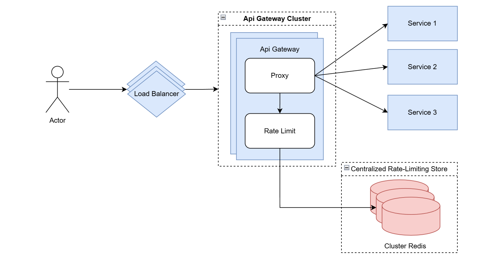

# README - Bài 2: API Gateway Cluster với Rate Limiting

## **Mô tả**
Hệ thống API Gateway phát triển nhanh chóng, yêu cầu được triển khai trong mô hình cluster. Chức năng Rate Limiting core được thiết kế để hạn chế tần suất request nhằm ngăn ngừa các cuộc tấn công brute force và DDoS. Bài tập này phân tích và thiết kế hệ thống API Gateway Cluster kèm chức năng Rate Limiting hoạt động đồng bộ giữa nhiều node Gateway.

---

## **Sơ đồ hệ thống**

---

## **Thành phần hệ thống**

### **1. Load Balancer**
- **Vai trò**: 
  - Phân phối request đến các node API Gateway trong cluster.
- **Tính năng**:
  - Đảm bảo không node nào bị quá tải.
  - Hỗ trợ failover nếu một node Gateway gặp lỗi.

### **2. API Gateway Cluster**
- **Vai trò**:
  - Nhận request từ Load Balancer và forward đến các backend services.
  - Kiểm tra tần suất request qua chức năng Rate Limiting.
- **Thành phần**:
  - **Proxy**: Xử lý routing đến backend.
  - **Rate Limiting (Core Function)**: 
    - Kiểm tra request có vượt quá giới hạn hay không.
    - Tương tác với Redis Cluster để đảm bảo tính nhất quán.

### **3. Redis Cluster (Centralized Rate-Limiting Store)**
- **Vai trò**:
  - Lưu trữ trạng thái request từ các client (timestamp hoặc request count).
  - Cung cấp thông tin để các Gateway nodes đồng bộ.
- **Tính năng**:
  - Đảm bảo tính nhất quán giữa các node API Gateway.

### **4. Backend Services**
- **Vai trò**:
  - Xử lý logic nghiệp vụ cho request từ client.
- **Tính năng**:
  - Trả về kết quả sau khi request được API Gateway forward.

---

## **Luồng xử lý trong hệ thống**
1. **Client** gửi request đến Load Balancer.
2. **Load Balancer** phân phối request đến một API Gateway trong cluster.
3. **API Gateway**:
   - Kiểm tra tần suất request qua dịch vụ **Rate Limiting** bằng cách tương tác Redis Cluster để truy vấn trạng thái.
   - Nếu request vượt quá giới hạn, trả về mã lỗi `429 Too Many Requests`.
   - Nếu request hợp lệ, forward đến backend service tương ứng.
4. **Backend Service** xử lý và trả về kết quả cho client.

